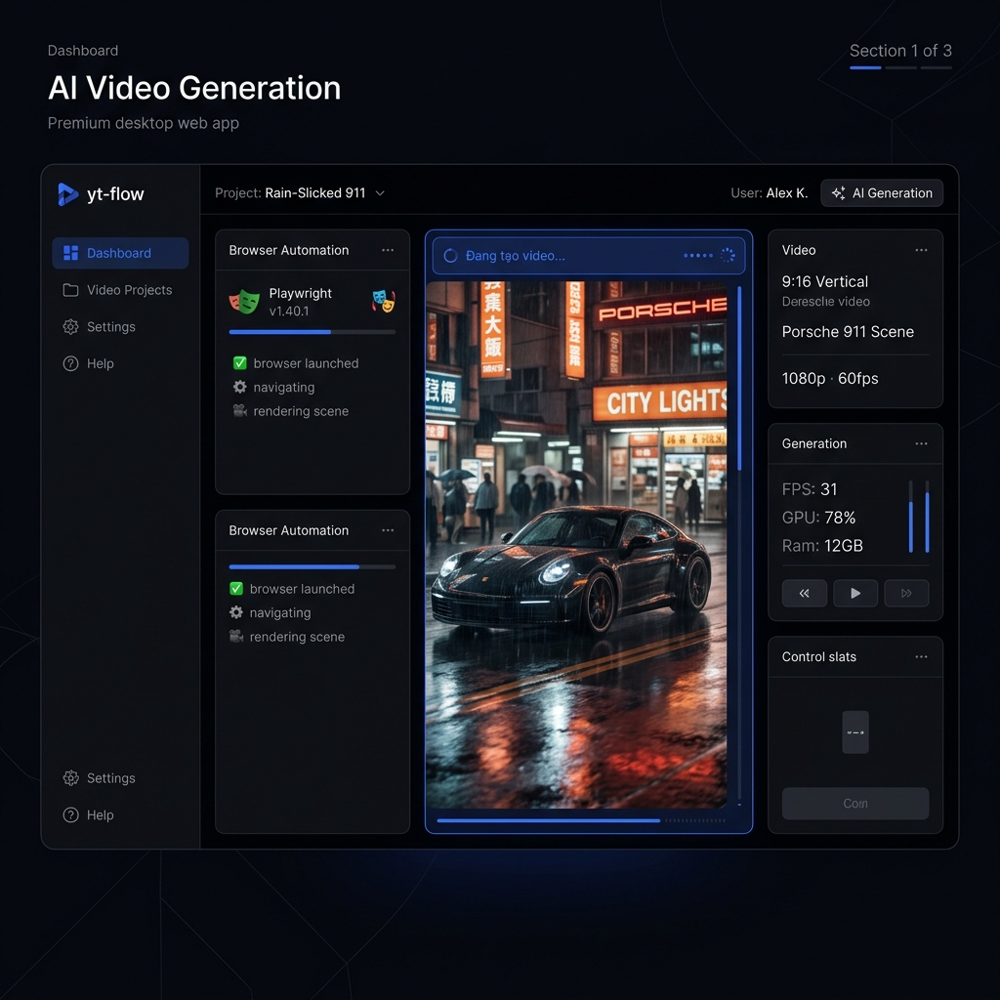
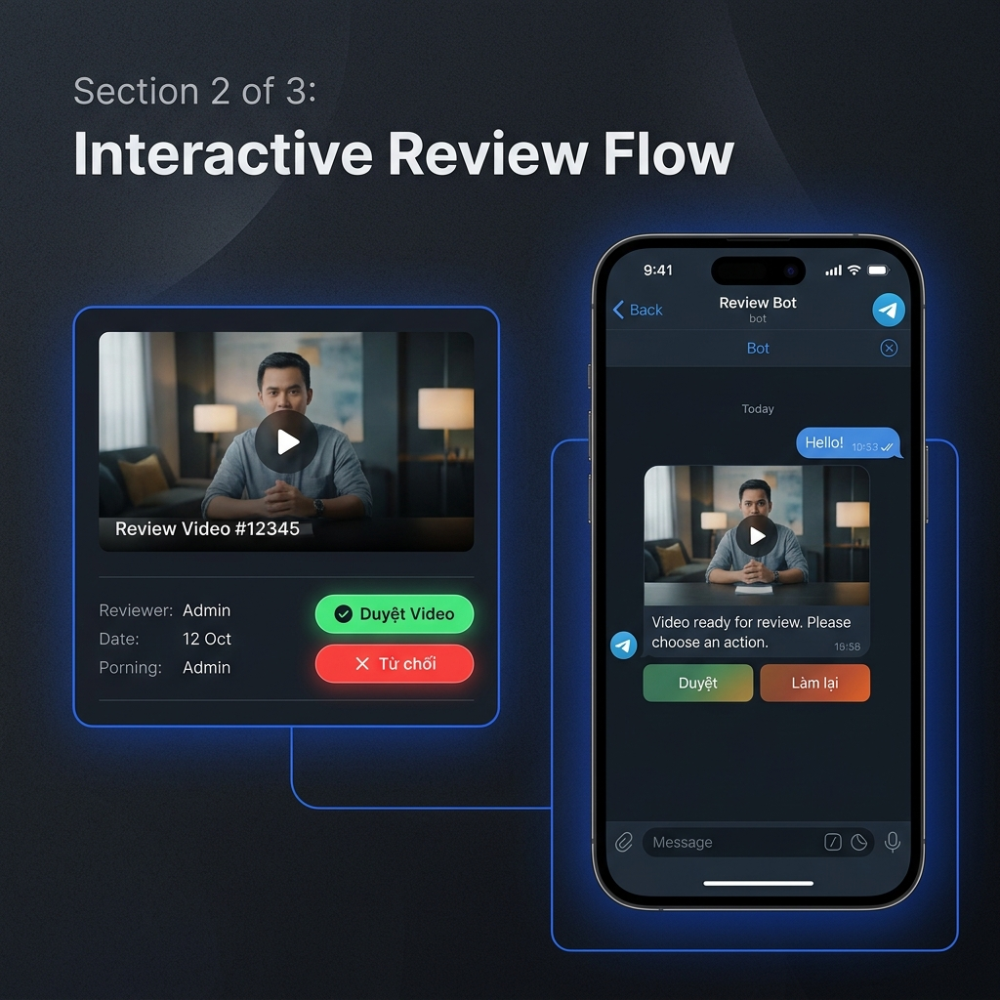
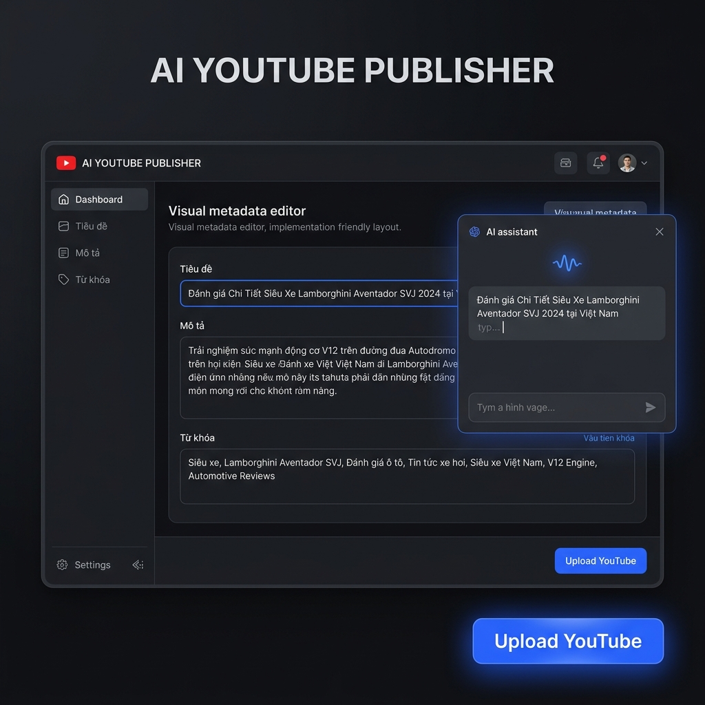

# Giới thiệu tính năng yt-flow

Dưới đây là các mô tả trực quan và chi tiết về 3 tính năng cốt lõi của hệ thống **yt-flow**:

---

## 1. Tự động tạo video bằng AI (AI Video Generation)
Hệ thống sử dụng Playwright điều khiển trình duyệt Chrome thực tế, kết nối với Gemini để tự động tạo video giới thiệu xe hơi định dạng dọc (9:16 Shorts) với độ phân giải và chất lượng cao nhất.

---

## 2. Luồng kiểm duyệt tương tác (Interactive Review Flow)
Trước khi đăng, bạn có thể dễ dàng kiểm tra chất lượng video. Hệ thống hỗ trợ kiểm duyệt đa nền tảng:
- **Web Dashboard**: Xem trực tiếp video và nhấn nút duyệt/tạo lại.
- **Telegram Bot**: Nhận trực tiếp video mẫu hoặc liên kết xem thử ngay trên điện thoại và gửi lệnh `/approve` hoặc `/reject` từ xa.

---

## 3. Sinh Metadata & Tự động Upload (AI YouTube Publisher)
Sau khi video được duyệt, Gemini API sẽ tự động soạn thảo tiêu đề, mô tả chuẩn SEO và từ khóa (Tags). Bạn có thể chỉnh sửa lại lần cuối ngay trên giao diện trước khi tự động upload lên YouTube Shorts.

